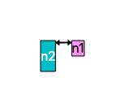

# BoxesAndArrows

BoxesAndArrows is a tool for generating diagrams.

It takes input like this:

```
box-style default { background-color: #FF90F4; text-color: black; }
box-style style1 { background-color: #00BFC8; text-color: white; }

box n1
box n2 { style: style1 }

connect n1 n2 { head1: filled_vee; head2: filled_vee; line-width: 2.0 }

constrain n1.left == n2.right + 20.0
constrain n1.top == n2.top
constrain n2.width >= n1.width
constrain n2.height == n1.height * 2
```

And outputs images like this:



## Requirements

BoxesAndArrows is written in Swift. Right now it requires macOS to run.
